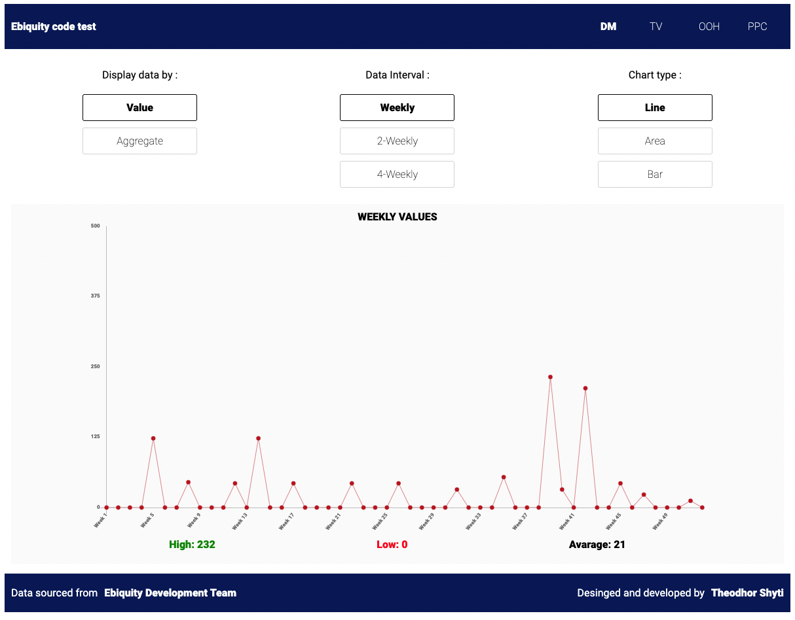
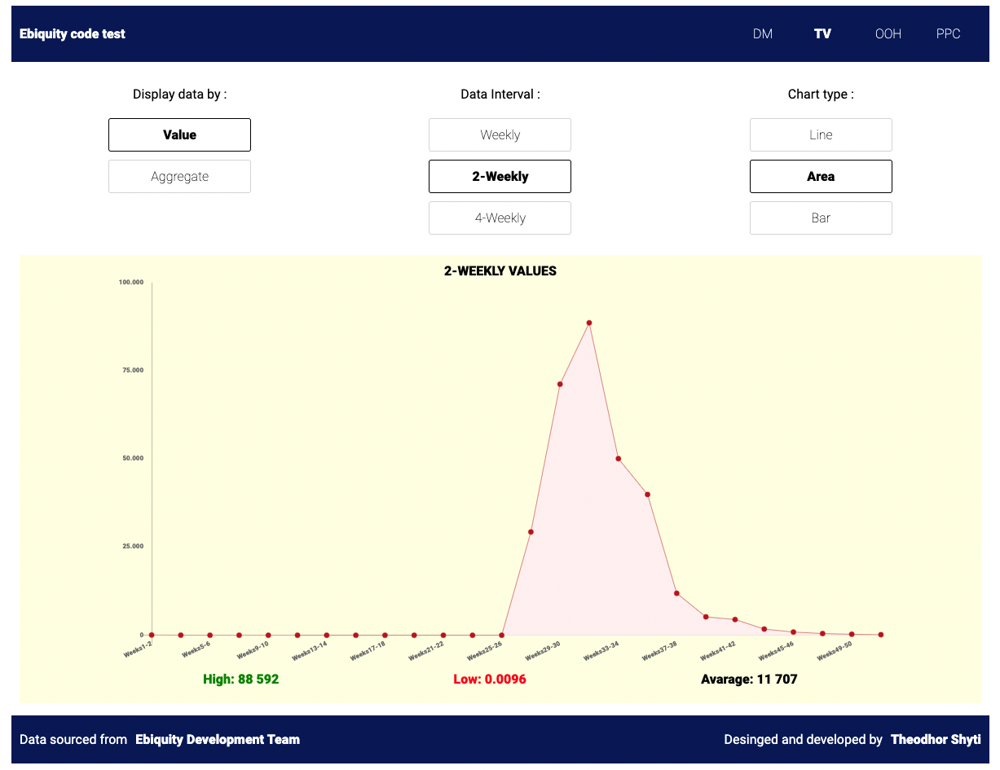
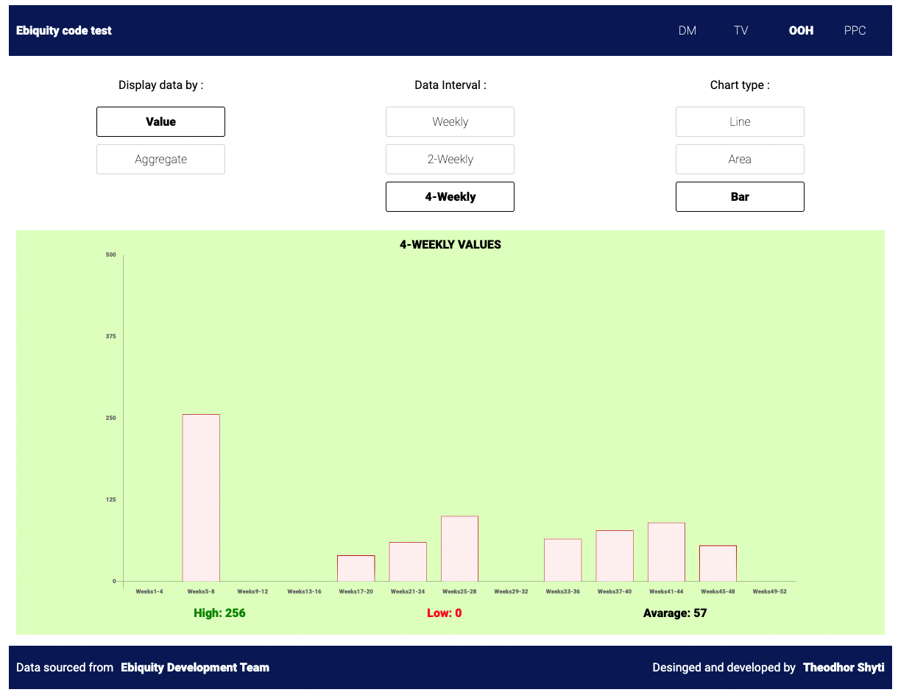
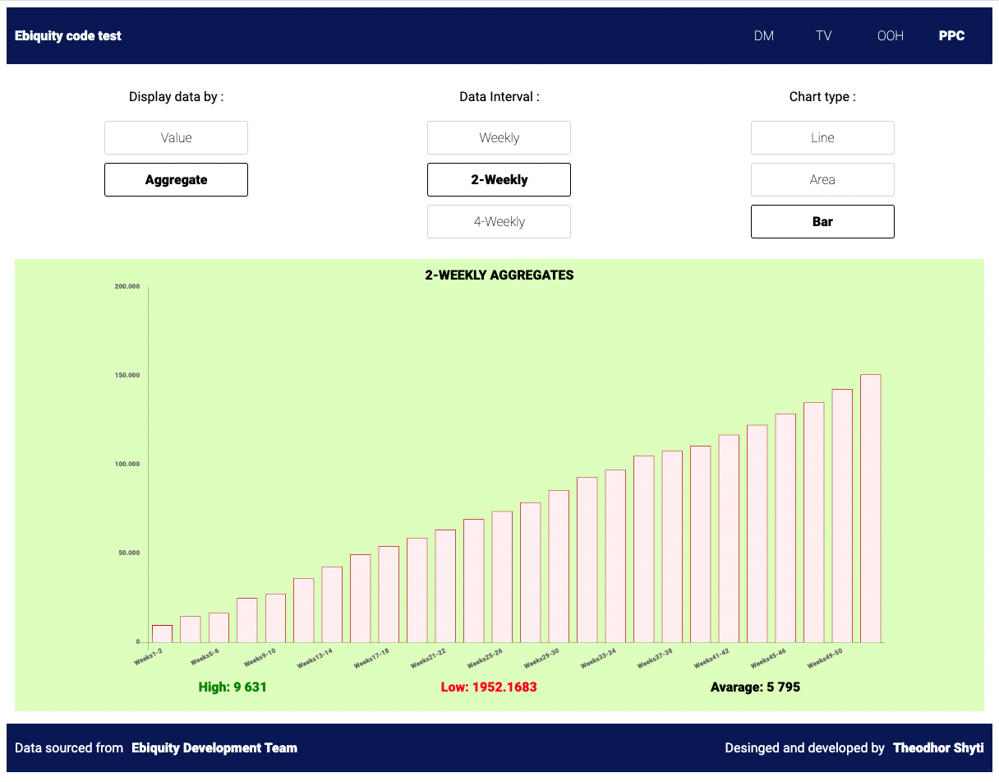

# Equibity code test

A data-visualisation code-test

## Objective 

* To display data through charts in an interactive way

* Option to group the data by 2 and 4 weeks

* Dinamically switch between different types of charts: Line, Area and Bar

* Opportunity to choose between normal and aggregate values

